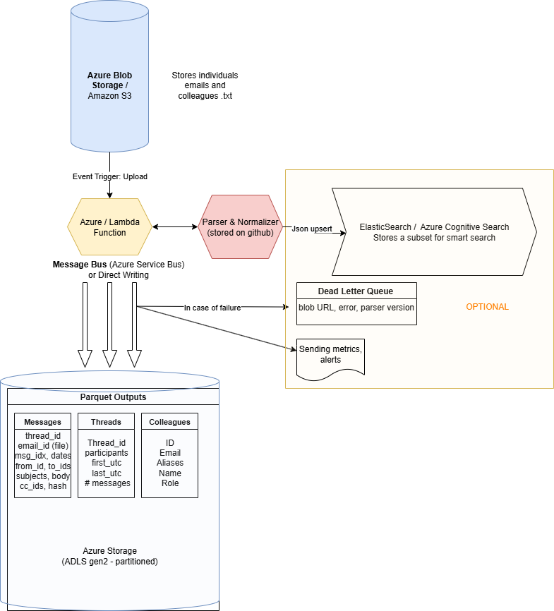
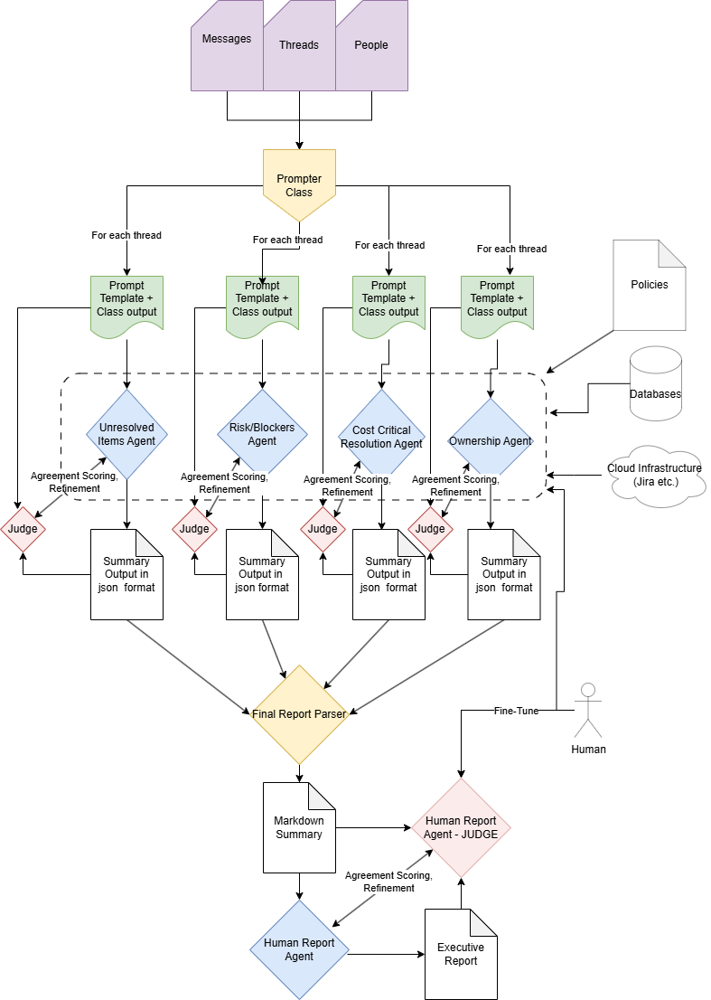

## Data Structure

The structure of my ZIP file differs from what is described in the task.

It contains:
- Multiple `emails_n.txt` files  
- A single `colleagues.txt` file  

There are no multiple folders — only one.  
I assume that the emails provided in that folder still correspond to multiple projects.
I also assume that `colleagues.txt` contains all the colleagues working across all projects.

---

## Data Ingestion & Initial Processing

The general pipeline and the dataflow is described in the diagram below. 
 - Blob Storage: Can be an AWS S3 bucket or a Azure Blob Storage, this stores our txt files. Let's assume Azure services from now on.
 - In case someone uploads new files to this storage, we trigger an event and the functions streams the files, calls our parser and normalizer python script that lives in a docker container. The logic of the parsing is not described here, but the core idea is that through series of regex functions and splitting we end up in a concise data format that is not missing any information.
 - In case of a simpler workflow we can directly write our parquet outputs, or we can create an Azure Service Bus (OPTIONAL) that enables us for parallelization, retries and buffering.
 - OPTIONAL: If we want to have a smart, natural language queries, we can use ElasticSearch or AzureCognitiveSearch services through json formats. Index only a subset (subjects, participants, dates, thread ids, limited body snippets) to keep cost low.
 - OPTIONAL:  We can monitor writing failures and metrics through Azure Monitor and can even quarantine our dead messages for further assesment.
 - We store our Parquet tables on Azure Data Lake Storage Gen2 (HNS), partitioned (e.g., by the thread id or year=YYYY/month=MM/day=DD) — especially important for messages
   - Messages: Containing each individual message in a separate row
   - Threads: Containing each individual indetified thread in a separate row
   - Colleagues: Containing each colleague in a separate row
  

**Cost Considerations:**
- We can cut costs on optional parts of the system, especially with leaving out ElasticSearch/Cognitive Search.
- We can leave out Service Bus as well and start using it if we need to upscale.
- In case we would have actual data of the amount of emails we need to process, we could lay out a cost plan, but considering email lengths and storage spaces this should not blow up.

**Scalability considerations:**
- Partitioning by ingest_date and/or thread_id prevents single monolithic files and enables partition pruning. We could schedule a merge on ingestion-time small files to 128–512 MB Parquet targets with 64–128 MB row groups. This balance eliminates the small-file problem while preserving enough files per partition to achieve high parallelism,  ensuring high I/O throughput for the analytical engine. The storage would have the structure for example: */messages/ingest_date/{thread}/message_part-0000.parquet*

**Security considerations:**
- Network:  All services in the pipeline should be configured to operate within a virtual network, using Private Endpoints. This ensures that data never traverses the public internet, drastically reducing the attack surface and protecting against external threats. 
- PII handling: During the parsing stage, the system should automatically identify and handle Personally Identifiable Information (PII).These then should be consistently hashed or replaced with role titles like 'Project_Manager_1'). (This was currently not a focus)

**Monitoring and Alerts:**
 - Possible service level objectives: ingestion latency,  pipeline success rate, DLQ rate
 - Metrics: queue depth/age, function duration/cold starts, DLQ count, bytes in/out, number of Parquet files per partition, cost per 1k emails.
 - Alerts: If the monitored metrics fall out of a pre-determined threshold.

### Architectural choices
- Blob Storage (ADLS Gen 2): We need to store our data, more precisely we need cheap, durable storage for possibly large raw text files. With blob storage we have cheap and durable solution. Hierarchical namespaces in Gen 2 offers bigger flexibility; faster and easier renaming, deleting, moving files and folders. It also promises improvement in performance which also translates to cost. If we were to use a simple relational DataBase it would  be tricky to store larger email bodies.
- Containerized parser: The parser could be packaged from GitHub as a versioned artifact/container, and we embed parser_version in every output row or store that information along with the files.
- Serveless Function: We don't need to maintain a server or a container to host our application. It is also pay-per use, so we are only charged after actual function calls. I have assumed a workflow where whenever we upload new data, the entire pipeline is ran without additional external actors, for this purpose event-driven solution is preferable.
- Parquet format: 5-10X smaller than JSON, so from scalability perspective it is better. Compared to a CSV format we can also store lists in columns, which is a big advantage in this scenario. We loose interoperability with it, but we also get fast column querries, which is quite common in our usecase. With this format in a scaled up system we would also need to incorporate periodic unification of smaller files, as these are immutable.
- LLM model: QWEN 2.5 was selected, as I needed a model that is relatively lightweight, still good at instruction following and processing formatted data. It is stated that "It demonstrates significant advancements in instruction following, long-text generation (over 8K tokens), understanding structured data (e.g., tables), and generating structured outputs, especially in JSON format." There should be further investigation done regarding models, for example compare results with llama 3.1.

## Analytical Engine
Our analytical engine takes as input the 3 parquet files specified in the earlier stage. 
A Prompter class with pre-defined templates create a series of prompts, for each thread, for each Critical Flag.
The **Critical Flags** were indetified from a perspective of what a director would be interested in. As the task description already provided 2 very strong clues, I have incorporated those into my solution.
- Unresolved Items: It's task is to indetify threads where we have unresolved tasks, or there is no clear closing of a work item.
- Risks/Blockers: It's task is to identify whether there is material or business risk involved or if there is a work item that is being blocker for some reason.
- Ownership Ambiguity: It's task is to indetify threads where the resolution doesn't specify who will do a task, or if there is a topic without clear owners.
- Cost Criticality: It's task is to identify if threads have resolutions that will have cost consequences for the company.
 For all of these aspects, we form a **Prompt Template** which:
  - Define the **role** of the agent
  - Pulls in the whole simplified thread with **participants**.
  - Specifies output **format**
  - Includes negative-positive **examples** for some cases
  - Specifies **labels** for outputs
  - Asks for **confidence** in the decision.

 At this point we can specify that these are not currently real agents, as they do not act or communicate in a real world environment. But for a production system we could attach necessary *Databases* , *Cloud infrastrucure*, *Company Policies* and any auxiliary information that is beneficial to the specific agent, introducing a RAG-like infrasctructure. These agents (if well tested and trusted) could then also refresh and modify the sources if they find contradicting information based on the emails (for example close a Jira ticket).
These Agents each form a strict JSON output stucture, that includes their decision on the thread.
These summarized JSON-s are then concatenated by the next parser based on a weighting strategy. This weighting strategy takes into consideration the confidence of the model in the output, the receny of the event, how long an event has been ongoing for. This weighting is a typical parts of the system where careful tweaking of hyperparameters is necessary, this could be done by evaluating the scores by a human in the loop, who is familiar with what is the most important factor is for a company/project. 

### LLM as judge and other considerations
Another component I would introduce into this infrastructure is using LLM-s as a judge. This is currently not implemented, as I have ran out of time, but the idea is that each agent would have designated judge, which based on the input, and the output provided by the agent, it could score how much it agrees with the agent and offer changes to the output based on evidence. These models can be the same model or different than which the agent uses.  With this extra context the agent can refine the output.

Currently all of our prompts are saved locally, this is not necessary, it only served debugging purposes. The same applies to the agents' output and the parsed findings. Currently our seperation is done by thread, if we were to have extended information on the company's projects, we could map each thread to a project, creating even more compact summaries. We can still try to do that by prompting, but that is non-deterministic and I wouldn't do such mapping.
We could gather some data to fine-tune to our agents on positive-negative examples if we can provide meaningful labels. 
Along the description I have presented solutions for the various considerations specified in the task, yet I still want to summarize those below.

### Cost & Robustness

Regarding robustness I think levaraging determinstic data parsing is key, we can't feed LLMs with with raw, unfiltered data. Judges also meant to catch incosistencies or misleading conclusions. Yet, if we want an extra layer of certainity, we can fine-tune our judges as well through human-labled data.
As for cost considerations we can monitor and limit our token consumption. We can clearly calculate from our database how many token we will have in a thread. After that if we combine that with our templates we can estimate the full consumption. If the judges are added to the system they certainly add extra costs, but the amount of refinement steps can be maximized and we can still monitor and calculate the amount of tokens consumed.
### Monitoring & Trust
I have described or judge system for improving trust in our system. We could also slightly modify it by using a unified judge after all 4 agents provided output, and only refine through additional context the necessary agent's output.
We also verify the output of each agent with Pydantic, which ensures that the output is in the specified format.
If we were to use LangChain and 
As for the metrics I would introduce:
- Human Agreement Rate:  It measures the percentage of AI-generated flags that the final human judge agrees with, specifically we can measure this on each agent's output and also in the final report.
- Precision and Recall: Also requires human labeling of teach thread.
- Hallucination Rate: The percentage of summaries that contain factual inaccuracies or information not present in the source threads.
- Confidence score distibutions: If we observe the distribution of the systems' output confidences we might track down issues.
- End-to-End runtime: We could monitor how long does it take to create our reports.
- Average cost per report.
- LLM Reliability: JSON-parse failure rate, number of retries.
- Disagreement rate: Number of times our judges disagreed to the 
### Architectural Risk & Mitigation
I think there are a couple of architectural risks, but the single biggest one is the misslabels or missed critical items from the 4 agents.
Threads can be long and multi-topic; naive chunking(which would be a factor in longer threads) or truncation skews model decisions and confidence. Contradicting information may appear as well.
To **mitigate** it I would create a golden dataset labeled by human oberservers and validate my json outputs against them, and even possibly use some of it to fine-tune the model. 

